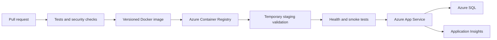

# Cloud-Based Appointment Scheduling and Booking System

A student-scale FastAPI appointment scheduling system designed to demonstrate secure booking, database consistency, containerization, CI/CD, Azure deployment, monitoring, and rollback practices.

## Current implementation stage

Phase 1 establishes the runnable backend foundation:

- FastAPI application with OpenAPI documentation
- Environment-based configuration
- SQLAlchemy models for users, providers, schedules, blocked periods, appointments, and audit records
- SQLite local development support
- SQL Server/Azure SQL connection configuration
- Alembic migration setup
- Database-level filtered unique index for active provider/time slots
- Docker image and local Compose configuration
- `/health` and `/ready` endpoints
- Initial API tests

Feature modules will be added incrementally after this foundation remains green.

## Implementation plan

1. Project foundation, configuration, models, and migrations
2. Authentication, JWT tokens, password hashing, and role authorization
3. Providers, schedules, blocked periods, and slot generation
4. Appointment booking, cancellation, rescheduling, and valid status transitions
5. Audit logging, error handling, and observability abstraction
6. Unit, API, security, and concurrency tests
7. Docker hardening and local execution
8. GitHub Actions CI/CD and security scanning
9. Terraform and Azure deployment configuration
10. Smoke tests, k6 performance tests, monitoring, and rollback evidence

The implementation deliberately uses a modular monolith. AKS, microservices, message brokers, Redis, and extra Azure networking services are outside scope because they add cost and operational complexity without improving the core evaluation.

## Technology stack

- Python 3.12+
- FastAPI, Pydantic, SQLAlchemy, Alembic
- SQLite for simple local development
- Azure SQL Database for Azure deployment
- Docker and Docker Compose
- GitHub Actions, Azure Container Registry, Azure App Service
- Azure Key Vault, Application Insights, and Azure Monitor

## Local setup

Create a local environment file:

```powershell
Copy-Item .env.example .env
```

Install dependencies with Python 3.12 or newer:

```powershell
python -m pip install -r requirements.txt
```

Apply migrations:

```powershell
alembic upgrade head
```

Run the API:

```powershell
uvicorn app.main:app --reload
```

Open the interactive API documentation at `http://127.0.0.1:8000/docs`.

## Tests and checks

```powershell
pytest -q
ruff check app tests
```

## Docker

The Dockerfile uses public PyPI by default. In environments that require the
Microsoft package feed, set `PIP_INDEX_URL` in `.env` before using Compose.

```powershell
docker build -t appointment-api:local .
docker run --env-file .env -p 8000:8000 appointment-api:local
```

For a simple local container run with persistent SQLite data:

```powershell
docker compose up --build
```

The Compose setup persists the local SQLite database in a named volume and
exposes the API at `http://127.0.0.1:8000`.

## Database configuration

The default local database is SQLite:

```text
DATABASE_URL=sqlite:///./appointment.db
```

Azure SQL uses a SQLAlchemy `mssql+pyodbc` URL. The Azure deployment must provide the connection value through App Service configuration or Key Vault integration, never through source control.

## Concurrency design

Booking will use a transaction plus a database-enforced unique filtered index on provider and start time for non-cancelled appointments. The database remains the final authority when simultaneous requests compete for the same slot. The API will translate a uniqueness conflict into HTTP 409 rather than allowing duplicate active appointments.

The eventual concurrency tests will run against a real SQL Server-compatible database, inspect persisted rows after the requests complete, and report successful bookings, conflicts, unexpected errors, duplicate rows, and response time.

## Azure and DevOps design

The planned delivery path is:



Terraform and GitHub Actions deployment workflows will be added after the application core is implemented. A production image will be tagged with the commit SHA so the previous known-good image can be restored during rollback.

## Security principles

- Passwords are stored only as password hashes.
- JWT and database configuration come from environment settings.
- Azure secrets belong in Key Vault.
- Backend authorization will be enforced for every protected route.
- ORM operations are used instead of string-built SQL.
- CI will include dependency, static, secret, and container scanning.

## Known limitations at this stage

- Authentication and appointment routes are not implemented yet.
- Azure resources have not been provisioned.
- Monitoring telemetry and alerts are planned, not claimed as configured.
- Concurrency and performance measurements will be added after booking exists.
- No production readiness claim is made; this is an academic prototype.
